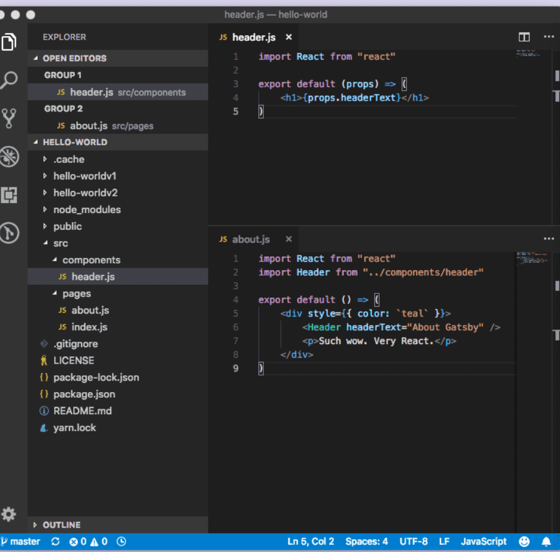

So let's say your building lot's of pages or the current pages are starting to get quite large, this where components and React really shine. So the pages have grown so its time to split the UI into independent, reusable pieces, and think about each piece in isolation.


from ReactJs.org 
**Conceptually, components are like JavaScript functions. They accept arbitrary inputs (called “props”) and return React elements describing what should appear on the screen.** 

so lets make a component that normally would be used across all the pages, the old trusty header!
First create a new file in the components folder called.. you guessed it header.js

copy in the following
```
import React from "react"
export default props => <h1>{props.headerText}</h1>
```
but wait! We see the props as the input inside of curly brackets. quickly let's dispel this scary notion, props are (appropriately enough) properties supplied to React components. 

simply put if you write the following React element on the page you want the component to render on(don't forgot to import the element) 
then you can define it's attribute. This makes components super reusable

```
<Header headerText="About Gatsby" />
```



now try and put this React component into another pager index or about or whatever you choose to make! Give it another headerText and see the power of React!

Thanks for reading and leave me a comment if you have any! I'll come back next time and demo layouts to show how multiple components can be grouped to shape the look repeatable pages such as a blog!