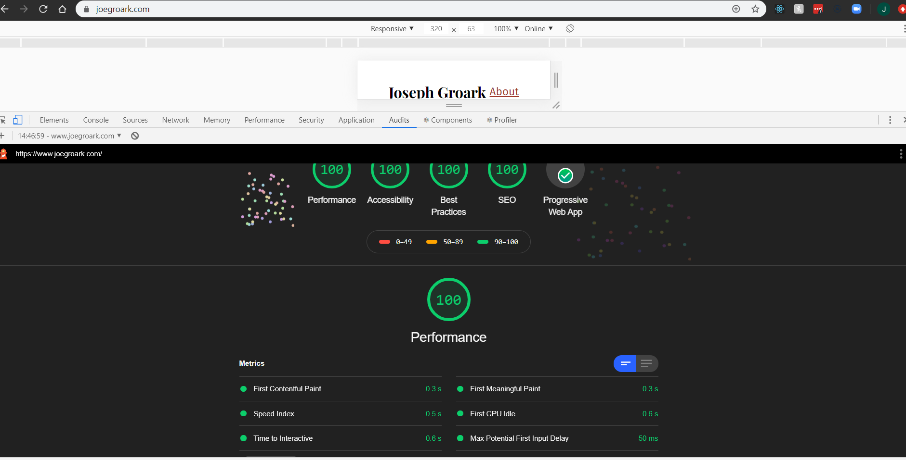

Well here we go, welcome to my little blog about my learning journey. I wanted to touchdown with a little Gatsby, it's not really too intimidating so let's dive in.

Firstly what is it and what does it do for you?
From gatsbyjs.org 

**"Gatsby is a free and open source framework based on React that helps developers build blazing fast websites and apps"**

Well that is all true especially regarding speed, this blog was made with Gatsby, do a audit from the devtools and you'll see some impressive scores!



Gatsby has a great tutorial on it's website has gets you going from zero to deployed in about an hour. It's noteworthy that Gatsby is part of a stack called JAMStack, it's all about fast and secure sites and apps delivered by pre-rendering files and serving them directly from a CDN, removing the requirement to manage or run web servers.

With all this said let me take you through my process of learning Gatsby.

## Getting started

If you're going to create a blog just like mine, just follow along.

The first thing I did is grab the Gatsby CLI, this enabled me to quickly create a new Gatsby-powered site and run commands for developing Gatsby. 

```npm install -g gatsby-cli```

Next like all good thing in life there is a starter kit to get you up and going with the bare essentials that gatsby needs.

```gatsby new hello-world https://github.com/gatsbyjs/gatsby-starter-hello-world```

After a fairly large download you can now change directory into the project you've just created and run a command to kick off a development server.

```gatsby develop```

And voilá you have a hello world on the localhost!


